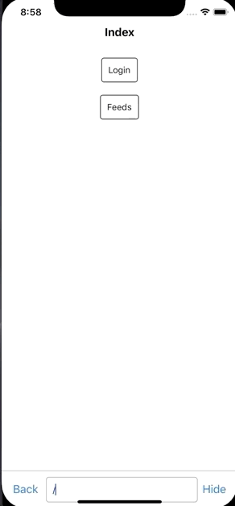
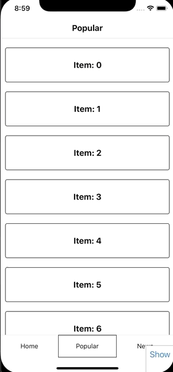
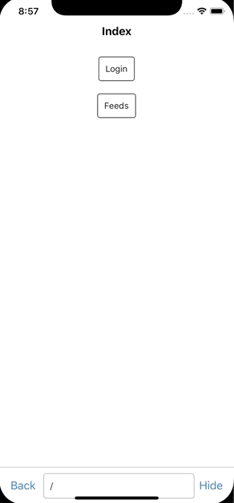

# react-navigation-library

A component-driven React Native navigation library.

- [Example project](https://github.com/CrowdLinker/react-navigation-library/blob/master/example/src/index.tsx)

<p align="center">
  
  
  
</p>

# Features

## Routing

- every screen is accessible by a route that you define
- routes are similar in API to `@reach/router` and `react-router`
- supports queries and params
- `<Link />` component supports relative and absolute paths
- location bar to navigate like in a browser while developing

**Why?**

Having routing at the core of your app architecture has a lot of benefits:

- deep links are a lot easier to set up
- navigating to specific screens while developing is a breeze
- your navigation logic is simpler to follow
- rendering navigators in isolation is extremely useful while developing / running integration tests

## Component-driven

- components are provided to logically structure and manage the focus of your app
- no static configurations, everything is dynamically rendered
- no opinions about where or how you render components, it's all determined by your markup
- granular control of mounting and unmounting based on focus

**Why?**

- composing navigators inside other navigators is much easier to setup
- familiar behaviour, its like any other react tree you've worked with
- passing props and state is entirely up to you
- more flexibility and control over what your app looks like because you're using your own components

## Gestures

- pan and swipe gestures to navigate between screens
- configurable via props

**Why?**

- panning and swiping behaviours are too important to ignore
- they can be configured to your app's needs or turned off via navigator props

This library uses `react-native-gesture-handler` and `react-native-reanimated` in hopes of improving performance over the core animated / pan gesture APIs in react-native.

# Install

`yarn add react-navigation-library`

If you're using expo, all dependencies are already installed by default. If not, you'll need to install two dependencies along with this library:

```
yarn add react-native-gesture-handler
yarn add react-native-reanimated
```

There are additional steps to setting these up:

- [react-native-gesture-handler](https://kmagiera.github.io/react-native-gesture-handler/docs/getting-started.html)
- [react-native-reanimated](https://github.com/kmagiera/react-native-reanimated#installation)

# Example

```
import React from 'react'
import { Navigator, Tabs, Link, Headers, Header, Tabbar, Tab } from 'react-navigation-library'

<!-- ./feeds.tsx  -->
<!-- full src at /example/src/feeds-example --> -->

function Feeds({  }: NavigatorScreen) {
  return (
    <Navigator routes={['home', 'popular', 'news']}>
      <Headers>
        <FeedHeader title="Home" />
        <FeedHeader title="Popular" />
        <FeedHeader title="News" />
      </Headers>

      <Tabs>
        <Feed items={items} />
        <Feed items={items} />
        <Feed items={items} />
      </Tabs>

      <Tabbar>
        <Tab to="home" activeStyle={{ borderWidth: 1 }}>
          <Text>Home</Text>
        </Tab>
        <Tab to="popular" activeStyle={{ borderWidth: 1 }}>
          <Text>Popular</Text>
        </Tab>
        <Tab to="news" activeStyle={{ borderWidth: 1 }}>
          <Text>News</Text>
        </Tab>
      </Tabbar>
    </Navigator>
  );
}

<!-- ./app.tsx -->

function App() {
  return (
    <Navigator routes={[ 'login', '/', 'feeds' ]} initialPath='/feeds/home' showLocationBar>
      <Tabs>
        <Entry />
        <Index />
        <Feeds />
      </Tabs>
    </Navigator>
  )
}

export default App
```

# API Reference

WIP
